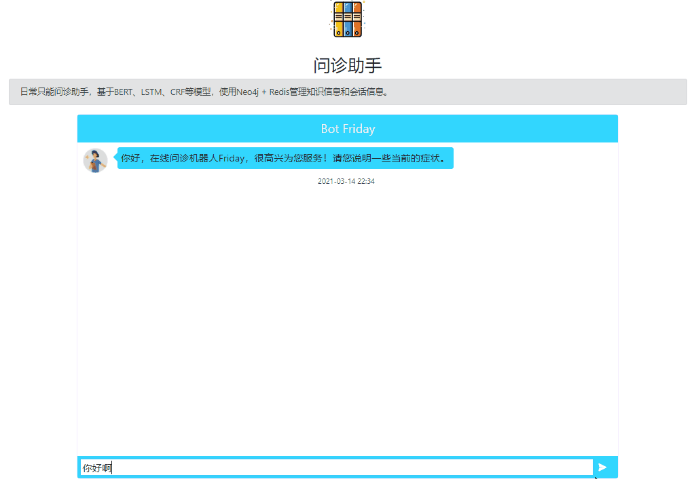
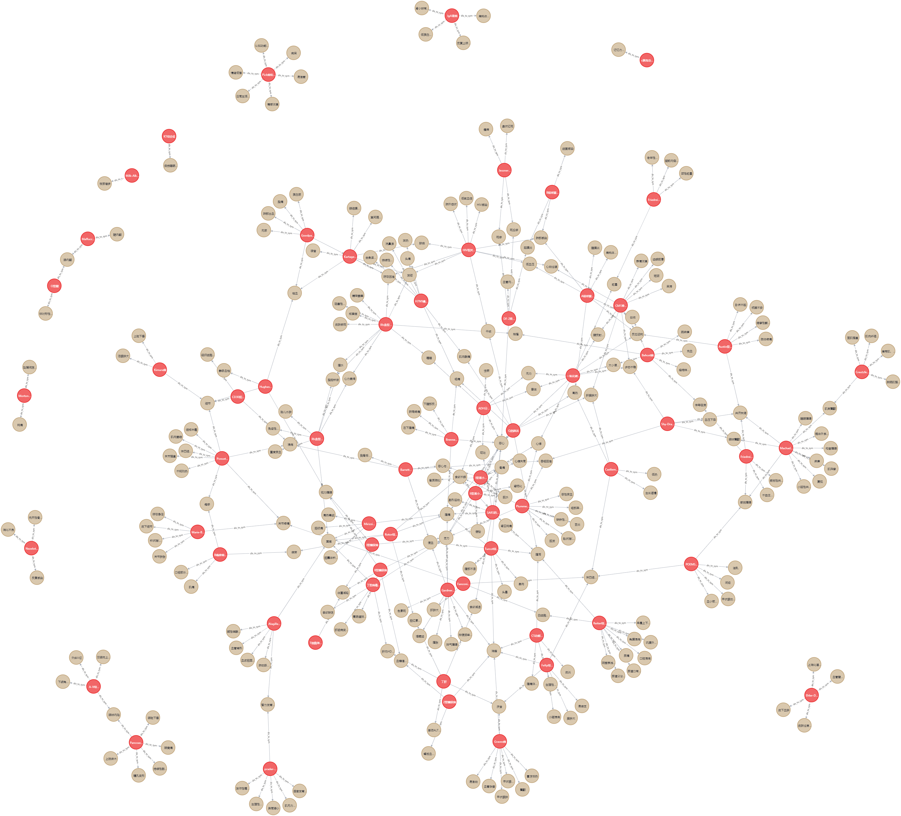

### Intro

项目任务是，针对用户输入的病症描述，回答疾病名称的单一任务问答助手。项目整体使用的模型并不复杂，思路比较简洁，尝试使用效果也还行。但是整体来讲，还是有很多提高的地方。

整体思路如下：

> 离线抽取 疾病与症状 的信息：
>
>  	1. 对于结构化数据，再次进行 实体审核 后，待加入Neo4j数据库。
>      - 实体审核使用RNN分类，构造的正负样本。问题在于，负样本构造方式直接reverse太不符合实际。最好人工审核相对真实的负样本，但是这时模型也该改进提升。
> 	2. 非结构化数据，使用BiLSTM + CRF模型进行信息提取。
>     - 在验证集只能取得78%的f1，可以使用其他更好的模型，离线相对较好处理，比如 [这个](https://github.com/RacleRay/PrivacyNER_with_NoisyData_CCF)。即使加上 实体审核模型，效果也一般。
>     - 所以非结构化数据的使用，在本repo的处理方式下，谨慎。
>
> 3. 离线训练 识别会话主体一致性 的模型。使用 BERT + FC 层进行二分类监督学习。
>    - 由于是有较多的监督数据，该任务使用BERT的效果很好。
>    - 实现了 非监督条件下，使用 BERT whitening 技术 进行语义分析，进行分类。模型效果当然比不上监督任务的效果。但是在没有更难一些的非监督任务要求下，可以尝试使用该模型。
>
> 在线部分 利用图数据库进行检索，Redis缓存会话信息，匹配诊断建议结果：
>
> 1. 将用户输入中的症状与图数据库中的症状节点进行匹配，返回相应的疾病节点。
>    - 首先，使用的实体关系比较简单，图数据没有最大发挥优势。使用一个字典建立关系，再在查询时求多个症状查询结果的交集，很多数据库都可以完成。不过熟悉一下Neo4j也挺好。
>    - Redis缓存对话内容，使用 会话主体一致性 识别模型，二分类 当前输入与上一句输入是否在 同一个语境下。比较简单的对话状态的跟踪处理方式，当然也是因为任务目标定义的比较简单，够用就好。
> 2. 根据是否新建对话和数据库匹配是否成功，分别采用不同的回复逻辑。通过BAIDU UNIT 闲聊对话接口，完成与主题无关对话的任务。
> 3. 对于用户属于中的病症提取，使用 AC自动机 进行匹配。
>    - 为啥不用NER？首先识别的结果是来当做key查询的，识别出新实体的泛化力没用。其次，已经知道要识别的就只有 病症 一个类型，还是已经有了作为key的字典的。


运行演示



部分图数据




### 运行

1. 开启Neo4j，redis服务
2. 运行 serve/bertpair_serve/app.py
3. 外部api接口 serve/main_serve/app.py，或者web展示 serve/web/app.py

[^注意设置python搜索路径的设置]: 


### requirments

```
flask
redis
neo4j-driver
transformers==2.9.1
torch==1.4.0
```


可选工具 Gunicorn：轻量级，高性能。减少丢包率

`pip install gunicorn==20.0.4`

```
nohup gunicorn -w 1 -b 0.0.0.0:5001 app:app > bertpairServe.file 2>&1 &
```


可选工具 werobot：部署微信服务号后台。


